# Brad Onboarding Doc

#### Welcome to the team :)

   
 

## Some of the basics

### **Error Reports**

Error reports are the  bread and butter for most technical issues where we need a little more info.

The way an error report is sent is as follows:

1) Open the video editor and click the "?" icon:

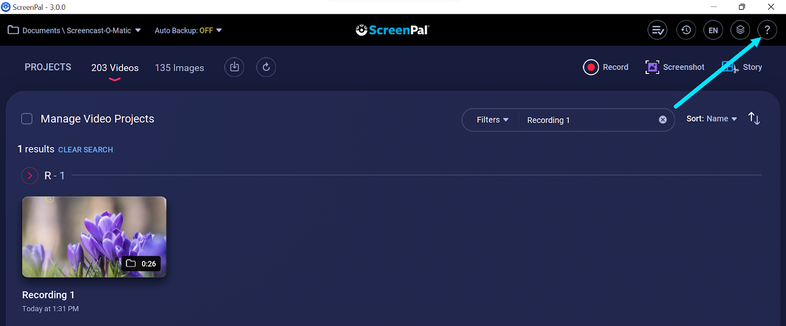

2) Enter a description of the problem and click send:

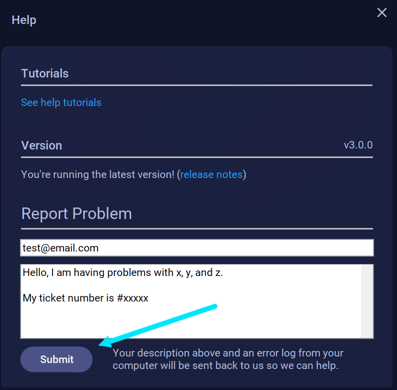

*Notice in the above image how there's the my ticket number is #xxxx, more on this in a second*

3) The error report gets sent to our zoho desk tickets. Error reports are easy to distinguish because the subject always says "SOM Error Report"

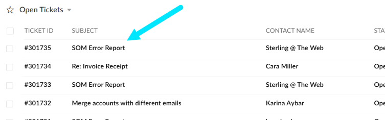

So back to the ticket # from step 2. The reason we ask customers to attach this is as simple as this we have an initial ticket with the user and ask them to send us an error report:

And as of writing this, when they send an error report it always creates a new ticket, e.g. 

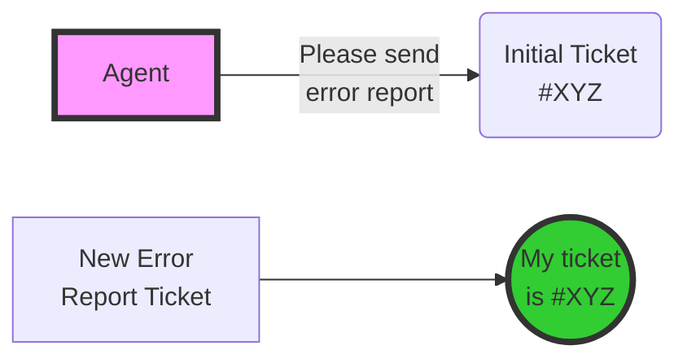

By having the customer attach their original ticket number it's easy for us to link the two. There is an automation to be released soon that will peform automatic assignent of the new ticket to the original agent assuming the user gave us the correct ticket number.

## Parsing Error Reports

Error reports are just a zip file of log files created by our app. The app files are named app-0.log, app-1.log, and app-2.log. App-0.log is the most recent followed by 1, followed by 2.

*You won't always see app-1.log and app-2.log if they just istalled the app.*

The best program for parsing the app is baretail.exe. This tool was recommended to me by AJ when I first started and it can be downloaded here:

http://www.baremetalsoft.com/baretail/

I recommend buying the premium version (one time purchase $25) as it allows for searching and overall it's better in my opinion.

I have a custom highlighting file that highlights important events in the log file.

It can be downloaded here:

https://drive.google.com/file/d/1DbAM5v9KEK8Sg7sP55RoTfii3aArkUPM/view?usp=sharing

Importing that into the app will give nice highlighting to important events as seen below:

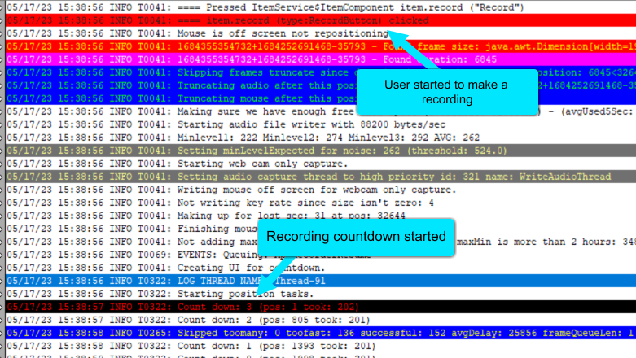

For showing off some of the important highlights of interest I've made a couple of quick videos that can be reviewed here:

**General error spotting:**

https://somup.com/c0hrcMaoDL

**Checking App and OS Version**

https://somup.com/c0hrc8aobc

*Note for versions of our app less thna 3.0.0 we typically will want to recommend they uninstall the old "Screencsat-O-Matic" version and install ScreenPal which is 3.0.0 and above*

**Some General Common Places To Look**

https://somup.com/c0hrVIaobo

Those are sort of the general log parsing tips and tricks. If there's any questions on parsing please don't hesitate to reach out!

## .screenpal Files

We get a fair amount of tickets where users seem to either have trouble publishing a specific recording or editing it. 

In these cases we often want to get a copy of the recording as a **.screenpal** file (formerly called a .somrec file). This is just a fancy name for a version of the recording where all of the edits are intact. This way we can test it just as it is in the users environment.

To export a recording as a .screenpal file here are the steps:

1) Open the ScreenPal video editor and click “Manage Video Projects”

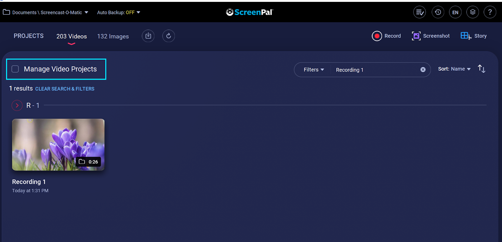

2) Select the recording, and click “Export” then choose a location to export to:

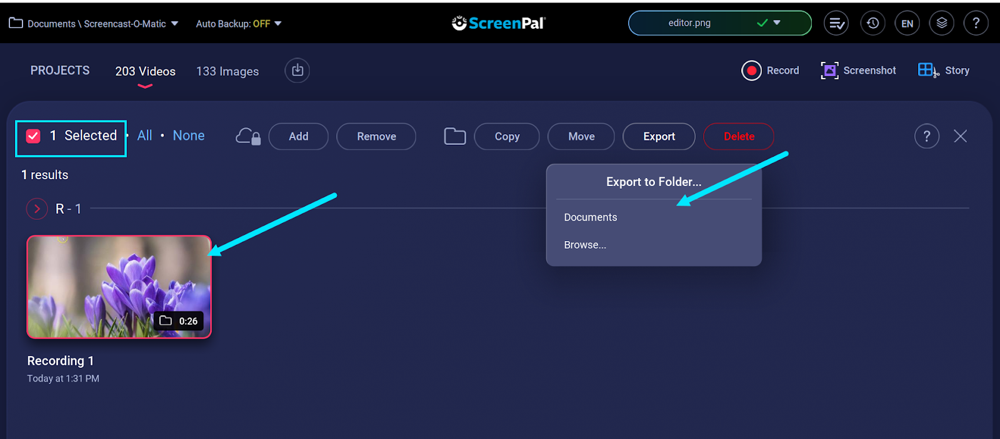

This will produce a file that is easily spottable assuming you have ScreenPal installed:

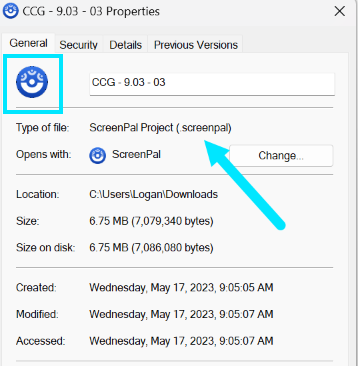

To import this file into the app all you have to do is make sure the ScreenPal video editor is open and then double click the file from the file explorer. It will then prompt you in ScreenPal if you want to import it:

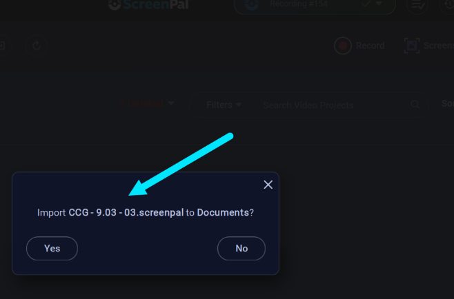

From there it's a matter of testing if the issue is reproducible. Which brings us to the next topic...

## Github issues

For known issues such as the sampling rate of the microphone being incorrect, or things like a restricted network blocking a download we don't need to create new github issues. 

With that being said when in doubt create an issue. It's better to have extra issues that we just close off than not reporting something that could be a serious bug.

The 2 main repos for creating issues are SOM-Support and SOM-WWW.

Let's first cover **SOM-Support** repo which can be found here:

https://github.com/bnsoftware/SOM-Support/issues

This is where we go to document general issues where it is not a known issue and our troubleshooting steps like log parsing and internet search have not turned up any results.

 As an example a couple months back there was an issue where the webcam background effects were always blurred despite the no effects option being checked. It was clear from the number of tickets reporting this that it was an issue, but there was no helpful info in the log files that could lead to a solution. Therefore a ticket was created:

 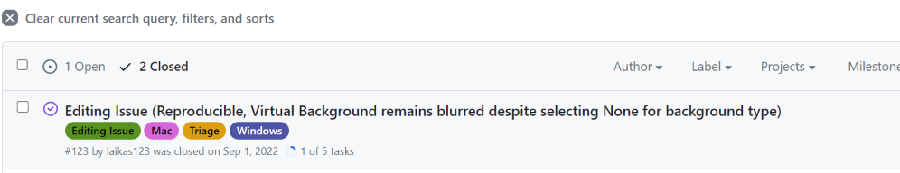

 Notice the title "Editing Issue". There are pre-defined issue templates for this github repo. So when creating a new issue you'll want to click the "New Issue" button and then select the template that sounds most related to your issue:

 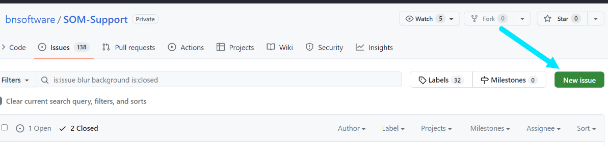

 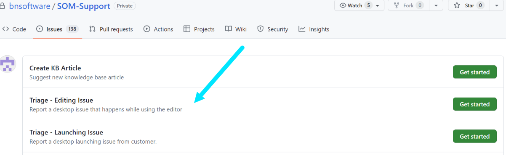

*Note if none of the templates seem exactly right for your description that is ok, choose the closest one, and feel free to change the title/template as needed*

Once you've clicked a template you'll get a page like the following:

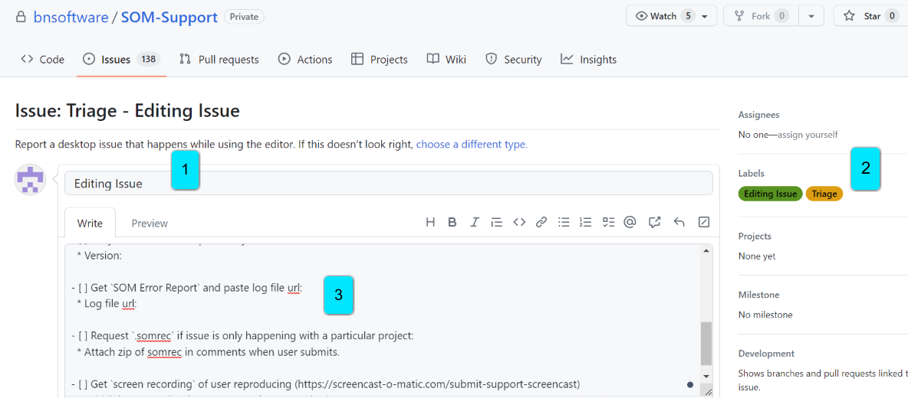

There's a fair amount going on here so I've labeled some of the bigger parts. Details below:

1) This clearly the title. I just wanted to point out though that it doesn't yet have the paranthesis like the other issue I had shown earlier. Typically our format it the issue type, followed by parenthesis with a short blurb of the issue. E.g. "Editing Issue: (Virtual Webcam Causing Crash)" so this is when you'd add a little blurb to the title.

2) On the right hand side are the labels. By default some are added for you. For instance here "Triage" and "Editing" were added. Typically the only labels we need to add are the OS type e.g. "Windows" or "Mac". We aren't very picky about labels.

3) This is the actual template for the issue. Here is where you can paste things like the ticket URL, a link to .screenpal files, a link to error reports, etc. These will make more sense over time and you **do not** need to have all of these to submit an issue. More is better, but we don't always get that, especially if the customer is upset and have already given us a reasonable amount of data to work off of. For this just trust yourself if you feel you have enough info to create a ticket with.

